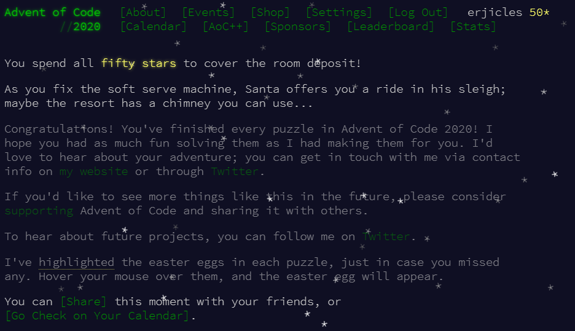

# Advent of Code 2020
To celebrate the end of 2020, I'm challenging myself to finish each of the 25
daily coding challenges from
[Advent of Code 2020](https://adventofcode.com/2020).

# Update
All done! I'm proud to say that I succeeded in my goal of completing each day's 
challenges on that day, and only needed to look for some help on a couple of
the puzzles! Many thanks to my wife for being patient with me and understanding
that Christmas itself was at stake.

## Dev Environment
* OS: Windows 10
* IDE: Visual Studio 2019 16.8+
* Project Type: Windows Console Application (C#)
* .NET Version: .NET 5

